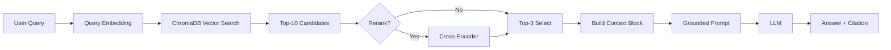

# Architecture — RAG Pipeline (Day 08 Lab)

> Template: Điền vào các mục này khi hoàn thành từng sprint.
> Deliverable của Documentation Owner.

## 1. Tổng quan kiến trúc

```
[Raw Docs]
    ↓
[index.py: Preprocess → Chunk → Embed → Store]
    ↓
[ChromaDB Vector Store]
    ↓
[rag_answer.py: Query → Retrieve → Rerank → Generate]
    ↓
[Grounded Answer + Citation]
```

**Mô tả ngắn gọn:**
> Hệ thống RAG này được xây dựng để trả lời các câu hỏi nghiệp vụ dựa trên tài liệu nội bộ của công ty. Nó bao gồm 3 pipeline chính: Indexing, Retrieval và Generation. Hệ thống giúp nhân viên tra cứu thông tin nhanh chóng và chính xác từ các tài liệu policy, SOP, FAQ mà không cần tìm thủ công.

---

## 2. Indexing Pipeline (Sprint 1)

### Tài liệu được index
| File | Nguồn | Department | Số chunk |
|------|-------|-----------|---------|
| `policy_refund_v4.txt` | policy/refund-v4.pdf | CS | 5 |
| `sla_p1_2026.txt` | support/sla-p1-2026.pdf | IT | 4 |
| `access_control_sop.txt` | it/access-control-sop.md | IT Security | 6 |
| `it_helpdesk_faq.txt` | support/helpdesk-faq.md | IT | 9 |
| `hr_leave_policy.txt` | hr/leave-policy-2026.pdf | HR | 4 |

### Quyết định chunking
| Tham số | Giá trị | Lý do |
|---------|---------|-------|
| Chunk size | 400 tokens | Nhóm chọn 400 tokens ước lượng (khoảng 1600 ký tự) để giữ trọn ngữ nghĩa của các đoạn policy/SLA vốn hay đi theo cụm điều kiện, ngoại lệ, và quy trình. Nếu nhỏ quá thì dễ vỡ ý, còn lớn quá thì retrieval kém chính xác vì một chunk chứa nhiều nội dung khác nhau; mức này là điểm cân bằng tốt cho bộ tài liệu hiện tại. |
| Overlap | 80 tokens | Nhóm đặt overlap 80 tokens (khoảng 320 ký tự) để giảm mất mát thông tin ở ranh giới chunk, nhất là với danh sách bước và câu có nhiều vế liên tiếp. Mức overlap này đủ nối mạch ngữ cảnh giữa hai chunk mà chưa gây trùng lặp quá nhiều khi truy hồi.
 |
| Chunking strategy | Heading-based  | Nhóm dùng chiến lược theo cấu trúc tài liệu: Đầu tiên tách theo heading "=== ... ===" trước, sau đó mới chia nhỏ theo độ dài khi cần; riêng FAQ thì tách theo cặp Q/A để giữ đúng đơn vị hỏi-đáp. Cách này tận dụng format có sẵn trong dữ liệu, giúp chunk rõ nghĩa và tăng độ chính xác retrieval so với cắt theo độ dài thuần túy. |
| Metadata fields | source, section, effective_date, department, access | Phục vụ filter, freshness, citation |

### Embedding model
- **Model**: Paraphrase-multilingual-MiniLM-L12-v2
- **Vector store**: ChromaDB (PersistentClient)
- **Similarity metric**: Cosine

---

## 3. Retrieval Pipeline (Sprint 2 + 3)

### Baseline (Sprint 2)
| Tham số | Giá trị |
|---------|---------|
| Strategy | Dense (embedding similarity) |
| Top-k search | 10 |
| Top-k select | 3 |
| Rerank | Không |

### Variant (Sprint 3)
| Tham số | Giá trị | Thay đổi so với baseline |
|---------|---------|------------------------|
| Strategy | TODO (hybrid / dense) | TODO |
| Top-k search | TODO | TODO |
| Top-k select | TODO | TODO |
| Rerank | TODO (cross-encoder / MMR) | TODO |
| Query transform | TODO (expansion / HyDE / decomposition) | TODO |

**Lý do chọn variant này:**
> TODO: Giải thích tại sao chọn biến này để tune.
> Ví dụ: "Chọn hybrid vì corpus có cả câu tự nhiên (policy) lẫn mã lỗi và tên chuyên ngành (SLA ticket P1, ERR-403)."

---

## 4. Generation (Sprint 2)

### Grounded Prompt Template
```
Answer only from the retrieved context below.0
If the context is insufficient, say you do not know.
Cite the source field when possible.
Keep your answer short, clear, and factual.

Question: {query}

Context:
[1] {source} | {section} | score={score}
{chunk_text}

[2] ...

Answer:
```
Câu hỏi 1: Mng viết prompt bằng tiếng anh hay tiếng việt? Có yêu cầu ngữ điệu hong? Xin nguyên văn 
Câu 2: Có câu lệnh ép AI trích nguồn không? Xin nguyên văn, có tự động gắn tag [1], [2] như ví dụ không? 
Câu 3: Nếu tài liệu ko có câu trả lời thì sao? 
Câu 4: Context đưa vào có score không?

### LLM Configuration
| Tham số | Giá trị |
|---------|---------|
| Model | TODO (gpt-4o-mini / gemini-1.5-flash) |
| Temperature | 0 (để output ổn định cho eval) |
| Max tokens | 512 |

---

## 5. Failure Mode Checklist

> Dùng khi debug — kiểm tra lần lượt: index → retrieval → generation

| Failure Mode | Triệu chứng | Cách kiểm tra |
|-------------|-------------|---------------|
| Index lỗi | Retrieve về docs cũ / sai version | `inspect_metadata_coverage()` trong index.py |
| Chunking tệ | Chunk cắt giữa điều khoản | `list_chunks()` và đọc text preview |
| Retrieval lỗi | Không tìm được expected source | `score_context_recall()` trong eval.py |
| Generation lỗi | Answer không grounded / bịa | `score_faithfulness()` trong eval.py |
| Token overload | Context quá dài → lost in the middle | Kiểm tra độ dài context_block |

---

## 6. Diagram (tùy chọn)

> TODO: Vẽ sơ đồ pipeline nếu có thời gian. Có thể dùng Mermaid hoặc drawio.


